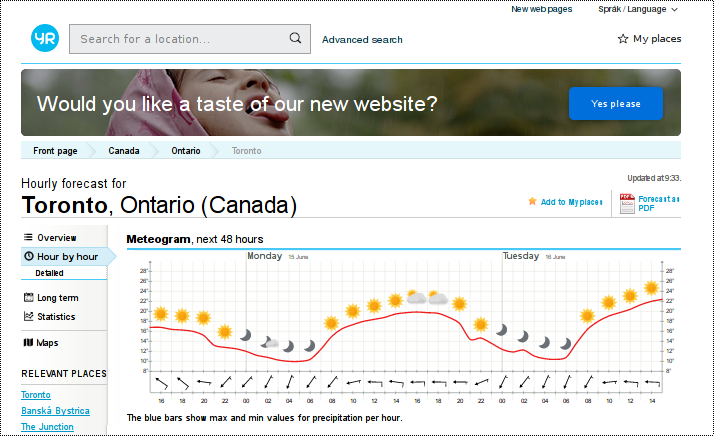
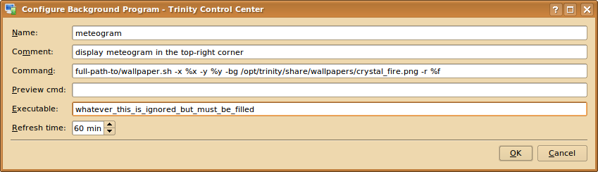
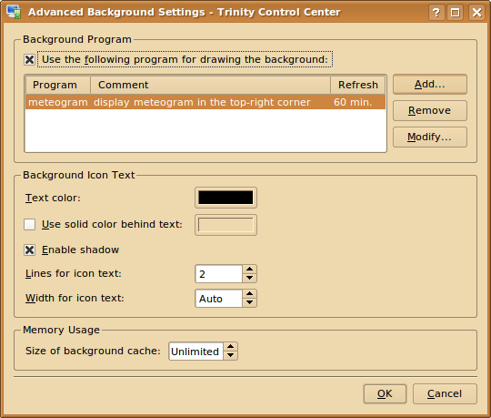

## yr.no hour-by-hour meteogram tools

The Norway Weather forecast website [https://www.yr.no](https://www.yr.no) provides user friendly graphical
representation of hour-by-hour weather conditions called meteogram. It combines temperature plot, sky conditions,
amount of rain and wind strength and direction in one picture:

Here are some linux tools to work with meteograms:

* meteogram.sh ... base level script to retrieve, cache, extract, scale and translate meteogram
* display-meteogram.sh ... meteogram utility for mpv (IPTV) player (full-screen timed display and refresh of meteogram)
* wallpaper.sh ... Trinity Desktop Environment (TDE) tool for inserting live meteogram into desktop wallpaper

Each script can be called by -h (-help) parameter to show usage help.

By calling script without any parameters the default values are used.
To modify defaults just edit section denoted:

    # DEFAULTS #
    #-----------
    ...
    ...
    # /DEFAULTS #
    #------------

### meteogram.sh

BASH script to retrieve hour-by-hour web page from [https://www.yr.no](https://www.yr.no) for specific location (wget).
The retrieved html page is cached locally for configurable time. The meteogram svg graphic is extracted and optionally
scalled to required dimensions (xmllint, sed). Optional simplistic text translation based on string find and replace
is also available (sed script). The result is either svg or html format.

    $ bin/meteogram.sh -h

    = weather meteogram = extract svg graphic meteogram from yr.no = (c) 2020.06.11 by Robert = https://github.com/blue-sky-r/yrno-tools =

    usage: ./meteogram.sh [-h][-d][-l tag][-t sec][-a agent][-c cache][-e exp][-cc CC][-i title][-s css][-u url][-o loc][-r res][-f force][-wxh WxH]

    h        ... this usage help
    d        ... verbose/debug output to stdout (overrides log setting)
    l tag    ... log output to logger with tag (default yr.no)
    t sec    ... http timeout in sec (default 7)
    a agent  ... user-agent string for html page retrieval (default Mozilla/5.0 Gecko/26.0 Firefox/26.0 * https://github.com/blue-sky-r/yrno-tools/meteogram.sh)
    c cache  ... cache file (default /tmp/cache-hour_by_hour.html)
    e exp    ... cache  expiry time (default 1 hour + 15 mins)
    cc CC    ... translate to language CC (default EN), empty is EN
    i title  ... html title (default empty), result is html format if title is provided, svg format otherwise
    s css    ... css style for html output (default body { background-color: black; cursor: none; } body div { display: table, margin: auto; })
    u url    ... url to get meteogram svg graphic (default https://www.yr.no/place/Canada/Ontario/Toronto/hour_by_hour.html)
    o loc    ... location instead of full url in the format Country/Province/City (default Canada/Ontario/Toronto)
    r res    ... result file (default /tmp/meteogram.html)
    f force  ... force update action (default empty)
                 wget - force cache refresh even within expiry period
                 svg  - force regeneration of meteogram
    wxh WxH  ... scale graphics to width W and height H (default empty), empty for no scaling = original size

    Required: pkg: libxml2-utils, script: [ meteogram-CC.sed for the translation to CC language ]

### dispaly-meteogram.sh

BASH script to retrieve (by calling meteogram.sh) and display full-screen meteogram for configurable time.
Firefox browser in kiosk-mode is used as svg+html full-screen viewer. To display the meteogram the firefox
is bring up to the front while IPTV mpv player in full-screen mode is sent to back. The browser is forced to refresh
the page to always display the updated meteogram. After configurable time the IPTV player is brought again to the front.

    $ bin/display-meteogram.sh -h

    = display meteogram = retrieve and display meteogram in viewer for defined time = (c) 2020.06.03 by Robert = https://github.com/blue-sky-r/mpv-wifi-rc =

    usage: ./display-meteogram.sh [-h][-d][-l tag][-s sec][-cc CC][-i title][-v title][-o loc][-r res][-a action][-b border][-wxh WxH]

    h        ... this usage help
    d        ... verbose/debug output to stdout (overrides log setting)
    l tag    ... log output to logger with tag (default yr.disp)
    s sec    ... show meteogram for time sec (default 30)
    cc CC    ... translate to language CC (default SK), empty is EN (no translation)
    i title  ... html title (default meteogram), result is in html format if title is provided, otherwise in svg format
    v title  ... iptv player title (default mpv)
    o loc    ... location in the format Country/Province/City (default Slovakia/Bansk%C3%A1_Bystrica/Bansk%C3%A1_Bystrica)
    r res    ... result file (default /tmp/meteogram.html)
    a action ... execute actions (default meteogram viewer refresh sleep iptv)
                 meteogram - call script meteogram.sh to retrieve svg/html
                 wget - force cache refresh even within expiry period
                 svg  - force regeneration of meteogram
                 viewer - execute viewer if not running and bring it to front
                 refresh - force viewer refresh
                 sleep - sleep (display meteogram)
                 iptv - bring iptv player to front
                 refresh - force refresh browser window
    b border ... border size (graphics will be smaller by border)
    wxh WxH  ... browser/viewer width W x height H (default 1920x1080)

    Required: pkg: wmctrl xautomation; script: meteogram.sh

This functionality is used for IPTV [mpv-wifi-rc](https://github.com/blue-sky-r/mpv-wifi-rc) (mpv wifi remote control).

### wallpaper.sh

TDE (KDE 3) Desktop Wallpaper config supportd user program to draw wallpaper. This feature is utilised by this BASH script
to dynamically render meteogram on the Desktop Wallpaper. This offers the user quick access to detailed weather forecast
for the next 48 hours. Position and size of the meteogram are configurable.

    $ bin/wallpaper.sh -h

    = generate desktop wallpaper png image with actual weather meteogram from yr.no = (c) 2020.06.10 by Robert = https://github.com/blue-sky-r/yrno-tools =

    usage: ./wallpaper.sh [-h][-d][-l tag][-cc CC][-bg image][-m margin][-b border] -x width -y height -o loc -r res

    h        ... this usage help
    d        ... verbose/debug output to stdout (overrides log setting)
    l tag    ... log output to logger with tag (default meteo-wallpaper)
    cc CC    ... translate to language CC (default is SK)
    bg image ... optional background image (default background-color: black)
    m margin ... css margin to position svg meteogram on html page (default 0 0 743 440)
    b border ... optional border around meteogram (default 3px solid cyan)
    x width  ... x-size (width  in pixels, default 1280)
    y height ... y-size (height in pixels, default 1024)
    o loc    ... location in the format Country/Province/City (default Slovakia/Banská_Bystrica/Banská_Bystrica)
    r res    ... result desktop wallpaper (png) file

    Required: pkg: cutycapt; script: meteogram.sh [meteogram-CC.sed]

    Examples

    Default position of meteogram in the right-top corner on Trinity crystal_fire wallpaper:

     > ./wallpaper.sh -x 1280 -y 1024 -bg /opt/trinity/share/wallpapers/crystal_fire.png -r /tmp/test.png

    Position of meteogram in the right-bottom corner on Trinity crystal_fire wallpaper:

     > ./wallpaper.sh -x 1280 -y 1024 -bg /opt/trinity/share/wallpapers/crystal_fire.png -m '600 0 0 200' -r /tmp/test.png

    Default position of meteogram on black background for for Toronto, CA

     > ./wallpaper.sh -x 1280 -y 1024 -bg black -loc 'Canada/Ontario/Toronto' -r /tmp/test.png

    Command for Trinity / Desktop / Advanced settings:

     > ./wallpaper.sh -x %x -y %y -loc 'Canada/Ontario/Toronto' -bg /opt/trinity/share/wallpapers/crystal_fire.png -r %f

### TDE custom wallpaper setup

To configire live meteogram for Trinity TDE wallpaper go to Trinity-Control-Center and select No-picture for Background:

Proceed to Advanced-Options and click Add:

Name and Comment have just informational value. Enter everything into Command field. Shell expansion works here,
so for example home dir ~ get expanded correctly. TDE provides parameters %x (width), %y (height)
and %f (result = generated wallpaper in png format). Leave Preview empty and enter anything into Executable field.
This is some TDE quicks as this field is copletely ignored but must not be left empty. Keep refresh time 60 min
to not abuse [yr.no Data-access-and-terms-of-service](https://hjelp.yr.no/hc/en-us/articles/360001946134-Data-access-and-terms-of-service).

After clicking OK you should get something like this

Click OK and then Apply in Trinity Control Center - Backgound. The just configured program will be immediately executed
and result displayed as wallpaper on the desktop. The wallpaper will be updated periodically as configured. If wallpaper
is not updated check syslog (default output goes to syslog) or execute script from command line and add -v (verbose)
output to stdout.

### keywords

weather, forecast, meteogram, TDE, Trinity Desktop, KDE3, wallpaper